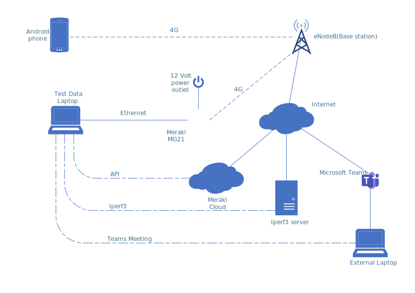
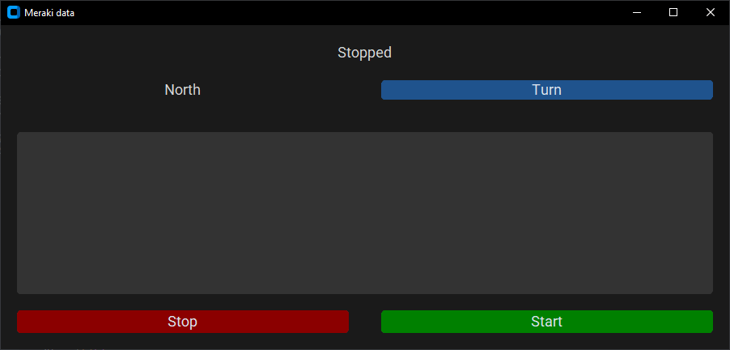

# Test Setup


## Laptop

### Python Script
The Python script ```TestScript``` was utilized to collect data from the Meraki API and record the driving direction of the test. To utilize the script, you need to fill out the ```MERAKI_API_KEY``` and ```MERAKI_ORG_ID``` in the ```.env``` file. The API key for ```MERAKI_API_KEY``` can be found under your profile on the Meraki Dashboard. You can obtain the organization ID for ```MERAKI_ORG_ID``` using the API and your API key. To utilize this functionality in Python, you can use:

```py
import meraki

API_KEY = ''
# https://github.com/meraki/dashboard-api-python/

dashboard = meraki.DashboardAPI(API_KEY)

response = dashboard.organizations.getOrganizations()

print(response)
```

Install the required libraries for the script. The ```requirements.txt``` file contains the required libraries for the script. They can be installed by running the following command:

```py
pip install -r requirements.txt
```

After the libraries are installed, you can run the script. You can start and stop logging with the Start and Stop buttons. When you stop the script and start it again, it will begin logging to a new file. Use the turn button to change the test direction between North and South. You can see if the script is logging or not at the top of the screen, and when new data is gathered, it will be displayed in the GUI.



### iPerf3
https://github.com/esnet/iperf

iPerf3 was used during testing to log upload and download speeds of the MG21 connection. To use iPerf3, you need an iPerf3 server to test your connection. There are public iPerf3 servers available, but using a server you do not have control over can give inconsistent results. 

To set up an iPerf3 server, download iPerf3 on the machine you want the server on and run:
```sh
./iperf3 -s
```

This will start an iPerf3 server on the default port 5201. You can find all the options for iPerf3 here if you want to change the default behavior: https://iperf.fr/iperf-doc.php.

Alternatively, you can run the iPerf3 server from a Docker container, as was done during this project. https://hub.docker.com/r/networkstatic/iperf3.

When the server is running, you can start the client. The option used during this project was:

```sh
.\iperf3.exe -c <SERVER_IP> -tinf -J --logfile testLog.json -P 4
```

This will initiate an upload test to ```SERVER_IP``` with 4 threads, using 4 threads, logging the results in JSON format to the file ```testLog.json```. The test will continue running until manually stopped. We have determined that utilizing multiple threads is necessary to achieve the maximum speed and fully utilize the connection's capacity. To test the download speed instead of upload, add the ```-R``` flag for reverse. 

### Web browser
We had a few browser windows open during testing to gather additional information. We had one window open with the Meraki dashboard displaying the frequency band it was using, and another window with a live clock to ensure accurate time for the test.

### Microsoft Teams
Microsoft Teams was running during the tests with a video call to an external computer to maintain a continuous flow of data and to check if the user experience would be affected during testing. 

### OBS Studio
https://obsproject.com/

OBS was used on the laptop during testing to record the screen for analysis after the test.

## Smartphone
### GPSLogger
https://github.com/mendhak/gpslogger/

GPSLogger was used on the smartphone to log GPS data during testing. It was set to log to a CSV file with a logging interval of 1 second, a distance filter of 0 meters, and an accuracy filter of 10 meters.

### G-MoN Pro
https://play.google.com/store/apps/details?id=de.carknue.gmonpro&hl=en&gl=US

G-MoN Pro was used on the smartphone to gather signal data during testing. This was done to obtain a secondary source of signal data for comparison with the MG21. G-MoN Pro also allowed for much shorter intervals between each data point, providing us with a greater amount of data. Additionally, G-MoN Pro was set to log data to a CSV file with an interval of 1 second.

# Elasticsearch
For this project, Elasticsearch with Kibana was utilized to store and visualize the data from the tests. Elasticsearch was set up using Docker.

https://www.elastic.co/guide/en/elasticsearch/reference/current/docker.html

Prior to running the Docker container, it is necessary to increase the ```vm.max_map_count``` for Elasticsearch to function properly. This can be achieved by executing the following command:

```sh
sysctl -w vm.max_map_count=262144
```

There are two ways of setting up the Docker containers for Elasticsearch and Kibana. You can configure the containers separately and link Kibana to the Elasticsearch container, or you can use Docker-compose.

## Docker Compose
Docker Compose is probably the easiest way to get Elasticsearch and Kibana running. The files needed for this can be found in the ```docker-compose``` directory. To get it up and running, simply modify the ```.env``` file to match your configuration and run the following command:

```docker
docker-compose up -d
```

This will run the container in the background and do the setup for you. When you want to stop the containers, use:

```docker
docker-compose down
```

## Docker 
To get Elasticsearch with Kibana up and running with just Docker is a bit more work than with Docker Compose.

### Elasticsearch
Create a docker network for the containers, pull the image for Elasticsearch and run the container:

```docker
docker network create elastic
docker pull docker.elastic.co/elasticsearch/elasticsearch:8.6.0
docker run --name es-node01 --net elastic -p 9200:9200 -p 9300:9300 -t docker.elastic.co/elasticsearch/elasticsearch:8.6.0
```

If you want to be able to reach Elasticsearch from another machine other than local host, set ```network.publish_host```.

```dockerfile
docker run --name es-node01 --net elastic -p 9200:9200 -p 9300:9300 -e network.publish_host=<HOST_IP> -t docker.elastic.co/elasticsearch/elasticsearch:8.6.0
```

### Kibana 
Get the Kibana image and run the container:

```dockerfile
docker pull docker.elastic.co/kibana/kibana:8.6.0
docker run --name kib-01 --net elastic -p 5601:5601 docker.elastic.co/kibana/kibana:8.6.0
```

On the first run, you will receive a link to the Kibana site, where you need to input the Elasticsearch enrollment token to connect Kibana to Elasticsearch. The next section will guide you on obtaining the enrollment token. In case you cannot access the provided link, you can access the Kibana container and add the enrollment token from there.

```sh
docker exec -it kib-01 bash
bin/kibana-setup --enrollment-token <your enrollment token here>
```

### Generate enrollment tokens and passwords for Elasticsearch

```Enrollment token:```
```sh
docker exec -it es-node01 /usr/share/elasticsearch/bin/elasticsearch-create-enrollment-token -s kibana
```

```Passord:```
```sh
docker exec -it es-node01 /usr/share/elasticsearch/bin/elasticsearch-reset-password -u elastic
```

## Connecting to Elasticsearch with Python
During the project, a certificate was used when connecting to Elasticsearch with Python. To obtain this certificate, run the following Docker command:

```docker
docker cp es-node01:/usr/share/elasticsearch/config/certs/http_ca.crt .
```

This command can look a bit different depending on how you set up the Docker containers. Both the container's name and the path to the certificate can change based on the method. In regular Docker, the path should be correct. If you used Docker Compose, the path should be ```/usr/share/elasticsearch/config/certs/ca/ca.crt``` instead. Once you have the certificate, you can connect to Elasticsearch with Python using it. Here's an example of how to test this:

```py
from elasticsearch import Elasticsearch

ELASTIC_PASSWORD = "<password>"

client = Elasticsearch(
    "https://<HOST_IP>:9200",
    ca_certs="../http_ca.crt",
    basic_auth=("elastic", ELASTIC_PASSWORD)
)

print(client.info())

```